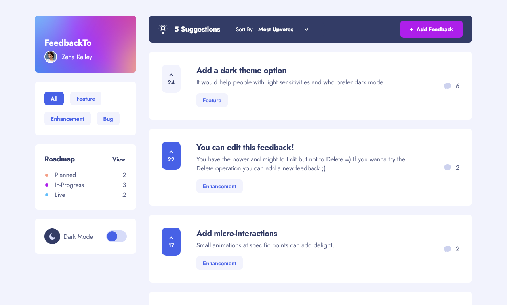

# FeedbackTo - Feedback Board

This is a solution to the following [Guru Frontend Mentor challenge](https://www.frontendmentor.io/challenges/product-feedback-app-wbvUYqjR6).

## Table of contents

- [Overview](#overview)
  - [Features](#features)
  - [Screenshot](#screenshot)
  - [Links](#links)
  - [Built with](#built-with)
- [Author](#author)

## Overview

### Features

- Dark mode
- Filter suggestions by category
- Sort suggestions by most/least upvotes and most/least comments
- Modal using React Portals
- Create, read, update, and delete product feedback requests
- Upvote product feedback requests
- Receive form validations when trying to create/edit feedback requests
- Add comments and replies to a product feedback request
- Optimal layout for the app depending on their device's screen size
- Hover states for all interactive elements on the page
- Feedback requests with a status of `planned`, `in-progress`, or `live` should show up on the roadmap page

### Screenshot

### Links

- Repository URL: [Github repository](https://github.com/jmarellanes/feedback-board)
- Live Site URL: [FeedbackTo - Feedback Board](https://feedbackto.josearellanes.me/)
- Solution URL: [Add solution URL here](https://your-solution-url.com)

### Built with

- Semantic HTML5 markup
- Accessible features
- CSS (Grid and Flexbox for layout) with BEM methodology
- Sass 
- React
- react-select
- React Hook form
- Serverless functions with Airtable as DB

## Author

- [Portfolio](http://www.josearellanes.me/)
- [Linkedin](https://www.linkedin.com/in/jmarellanes/)
- [Github](https://www.github.com/jmarellanes)
- [@jmarellanes](https://twitter.com/jmarellanes)
